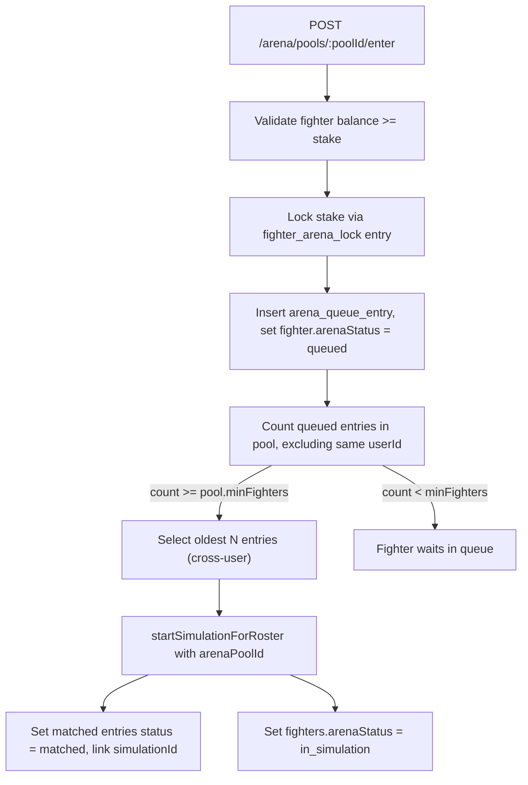

# Arena Pool and Matchmaker System

## Concept

An **arena pool** is a 3-dimensional bucket: network (e.g. `"sui"`) x stake tier (amount in native units) x battle mode (1v1, squad-4, squad-8, world-war). Users enter a fighter into a specific pool. When enough fighters from different users are queued in the same pool, the server instantly starts a simulation, locks each fighter's stake, and settles funds to the winner when the sim ends.

## Data Model

### New enum: `arena_battle_mode`

Values: `"1v1"`, `"squad_4"`, `"squad_8"`, `"world_war"`

Each mode has implicit fighter-count semantics:
- `1v1` -- exactly 2
- `squad_4` -- exactly 4
- `squad_8` -- exactly 8
- `world_war` -- 8 to 16 (starts at 8, can accept up to 16 before start)

### New enum: `arena_queue_status`

Values: `"queued"`, `"matched"`, `"cancelled"`

### New enum: `fighter_arena_status`

Values: `"idle"`, `"queued"`, `"in_simulation"`, `"settling"`

### New table: `arena_pools`

File: [database/src/schema/arena-pools.ts](database/src/schema/arena-pools.ts) (new)

```typescript
export const arenaPools = pgTable("arena_pools", {
  id: uuid("id").defaultRandom().primaryKey(),
  network: walletNetworkEnum("network").notNull().default("sui"),
  battleMode: arenaBattleModeEnum("battle_mode").notNull(),
  stakeAmountNative: numeric("stake_amount_native", { precision: 30, scale: 0 }).notNull(),
  minFighters: integer("min_fighters").notNull(),
  maxFighters: integer("max_fighters").notNull(),
  isActive: boolean("is_active").notNull().default(true),
  createdAt: timestamp("created_at", ...).defaultNow().notNull(),
}, (table) => [
  uniqueIndex("arena_pools_network_mode_stake_key").on(table.network, table.battleMode, table.stakeAmountNative),
]);
```

The `network` column reuses the existing `walletNetworkEnum` from [database/src/schema/wallet-networks.ts](database/src/schema/wallet-networks.ts) (currently only `"sui"`). This means pool stake amounts are always interpreted in the native unit of the specified network (MIST for SUI). When new networks are added to the enum, new pools can be seeded for those currencies without schema changes.

Seed 20 rows (5 tiers x 4 modes) in the migration. Tiers in MIST:
- 1 SUI = `1000000000`
- 10 SUI = `10000000000`
- 50 SUI = `50000000000`
- 100 SUI = `100000000000`
- 1000 SUI = `1000000000000`

### New table: `arena_queue_entries`

File: [database/src/schema/arena-queue-entries.ts](database/src/schema/arena-queue-entries.ts) (new)

```typescript
export const arenaQueueEntries = pgTable("arena_queue_entries", {
  id: uuid("id").defaultRandom().primaryKey(),
  poolId: uuid("pool_id").notNull().references(() => arenaPools.id),
  fighterId: integer("fighter_id").notNull().references(() => fighters.id, { onDelete: "cascade" }),
  userId: uuid("user_id").notNull(),
  status: arenaQueueStatusEnum("status").notNull().default("queued"),
  simulationId: uuid("simulation_id").references(() => simulations.id, { onDelete: "set null" }),
  lockCorrelationId: text("lock_correlation_id"),
  queuedAt: timestamp("queued_at", ...).defaultNow().notNull(),
  matchedAt: timestamp("matched_at", ...),
}, (table) => [
  // Only one active (queued) entry per fighter across ALL pools
  uniqueIndex("arena_queue_entries_fighter_queued_key")
    .on(table.fighterId)
    .where(sql`${table.status} = 'queued'`),
  index("arena_queue_entries_pool_status_idx").on(table.poolId, table.status),
]);
```

The partial unique index `arena_queue_entries_fighter_queued_key` enforces that a fighter can only be queued in one pool at a time at the DB level.

### Column on `fighters`: `arena_status`

Add `arenaStatus: fighterArenaStatusEnum("arena_status").notNull().default("idle")` to [database/src/schema/fighters.ts](database/src/schema/fighters.ts).

This is a denormalized status for fast reads. The authoritative source is the queue/simulation state, but this column avoids N+1 queries when listing fighters.

### Link on `simulations`: `arena_pool_id`

Add `arenaPoolId: uuid("arena_pool_id").references(() => arenaPools.id, { onDelete: "set null" })` to [database/src/schema/simulations.ts](database/src/schema/simulations.ts).

This distinguishes arena-initiated simulations from manual/terminal simulations. Settlement logic only runs for sims with a non-null `arenaPoolId`.

### Migration

A single migration `0013_arena_pools.sql` that:
1. Creates the three new enums
2. Creates `arena_pools` with seed data (20 rows)
3. Creates `arena_queue_entries` with indexes
4. Adds `arena_status` column to `fighters` (default `'idle'`)
5. Adds `arena_pool_id` column to `simulations` (nullable)

## Backend Services

### Arena Pool Repository

File: [api/src/lib/arena/pool-repository.ts](api/src/lib/arena/pool-repository.ts) (new)

- `listActivePools()` -- returns all active pools with current queue counts (grouped by pool)
- `getPoolById(poolId)` -- single pool lookup
- `enqueueFighter({ poolId, fighterId, userId, lockCorrelationId })` -- insert queue entry + set `fighters.arenaStatus = 'queued'`
- `dequeueFighter({ fighterId, userId })` -- set queue entry status to `'cancelled'` + set `fighters.arenaStatus = 'idle'` + unlock funds
- `matchQueueEntries({ poolId, entries })` -- batch-update entries to `'matched'` with simulationId
- `getQueuedEntriesForPool(poolId)` -- list queued entries with `status = 'queued'`, grouped by userId to enforce cross-user constraint
- `getActiveFighterQueueEntry(fighterId)` -- returns the active queue/matched entry if any
- `setFighterArenaStatus(fighterId, status)` -- update denormalized status

### Balance Lock Service

File: [api/src/lib/arena/balance-lock.ts](api/src/lib/arena/balance-lock.ts) (new)

Uses the existing ledger infrastructure with a new ledger kind.

**New fighter ledger kind**: `"fighter_arena_lock"` (negative, locks funds) and `"fighter_arena_unlock"` (positive, releases funds). Add to `fighterLedgerKindEnum` in [database/src/schema/fighter-ledger-entries.ts](database/src/schema/fighter-ledger-entries.ts).

To avoid needing a paired wallet ledger entry (current FK constraint), there are two approaches:
- **Option A**: Make `walletLedgerEntryId` nullable on `fighter_ledger_entries` (lock entries have no wallet counterpart)
- **Option B**: Create a system/escrow wallet that acts as the counterparty for lock entries

**Recommendation: Option A** -- add a migration to make `walletLedgerEntryId` nullable and adjust the unique index. Lock/unlock entries are fighter-only bookkeeping with no wallet movement.

Functions:
- `lockFighterStake({ fighterId, amountNative, poolId, correlationId })` -- insert `fighter_arena_lock` entry with `-amountNative`, returns `lockCorrelationId`
- `unlockFighterStake({ fighterId, correlationId })` -- insert `fighter_arena_unlock` for `+amountNative` (refund on cancel/draw)
- `getFighterAvailableBalance(fighterId)` -- `getFighterBalanceNative(fighterId)` (locks are already negative entries in the sum)

With this approach, `getFighterBalanceNative` (which is `SUM(amount_native)`) **already accounts for locks** -- a locked fighter's reported balance is reduced by the lock amount. The "available" balance is the total balance. A fighter with 10 SUI balance and a 1 SUI lock shows 9 SUI available.

### Matchmaker

File: [api/src/lib/arena/matchmaker.ts](api/src/lib/arena/matchmaker.ts) (new)

Triggered synchronously after a fighter is enqueued. Flow:



Key matching rules:
- Only one entry per `userId` in a single match (cross-user enforcement)
- Pick the oldest queued entries first (FIFO fairness)
- For `world_war` mode: start as soon as `minFighters` (8) unique users are queued; don't wait for `maxFighters` (16)
- If matching fails (not enough cross-user entries), the newly-queued fighter simply waits

### Settlement Integration

In [api/src/lib/simulation-orchestrator.ts](api/src/lib/simulation-orchestrator.ts), extend `finalizeEndedSimulation`:

After `markSimulationEnded`, if the simulation has an `arenaPoolId`:
1. Load the pool's `stakeAmountNative`
2. Load all `simulation_participants` for this sim
3. If `winnerFighterId` is set:
   - For each **losing** participant, their lock was already applied at queue time (balance already reduced). Call `appendSimulationSettlement` for each loser->winner pair with the pool's stake amount.
   - Update all fighters' `arenaStatus` to `'idle'`
4. If `winnerFighterId` is null (draw):
   - Unlock each fighter's stake via `unlockFighterStake`
   - Update all fighters' `arenaStatus` to `'idle'`
5. Wrap in try/catch: on settlement failure, log with simulation correlation metadata but still mark sim as ended (lifecycle integrity > settlement atomicity, per the existing settlement plan's behavior rules)

### Multi-loser settlement adjustment

The current `appendSimulationSettlement` handles a single loser/winner pair. For N-fighter pools, the winner collects from (N-1) losers. Call it in a loop -- one settlement leg per loser. Each loser's `fighter_sim_bet_out` is the pool stake; the winner's `fighter_sim_bounty_in` accumulates across all legs.

## API Routes

File: [api/src/routes/arena/index.ts](api/src/routes/arena/index.ts) (new)

All authenticated via `requireBearerAuth`.

- **`GET /arena/pools`** -- list active pools with queue counts per pool
- **`GET /arena/pools/:poolId`** -- single pool detail + queue entries (fighter IDs, user IDs, timestamps)
- **`POST /arena/pools/:poolId/enter`** -- body: `{ fighterId: number }`, triggers matchmaker
- **`POST /arena/pools/:poolId/leave`** -- body: `{ fighterId: number }`, cancels queue entry + unlocks funds
- **`GET /arena/me/queue`** -- list my fighters' active queue entries with pool info
- **`GET /arena/me/active`** -- list my fighters currently in arena simulations (status = `in_simulation` or `settling`)

Mount under `guardedHttp` in [api/src/index.ts](api/src/index.ts).

## Shared Schemas

File: [shared/src/schemas/api/arena.ts](shared/src/schemas/api/arena.ts) (new)

Zod schemas for:
- `arenaPoolSchema` (id, battleMode, stakeAmountNative, minFighters, maxFighters, isActive, queuedCount)
- `arenaPoolListResponseSchema`
- `arenaEnterPoolRequestSchema` (`{ fighterId: z.number().int().positive() }`)
- `arenaLeavePoolRequestSchema` (same)
- `arenaQueueEntrySchema` (id, poolId, fighterId, status, queuedAt, matchedAt, simulationId)
- `arenaMyQueueResponseSchema`

Export from [shared/src/schemas/api/index.ts](shared/src/schemas/api/index.ts) and [shared/src/schemas/index.ts](shared/src/schemas/index.ts).

## Frontend Changes (minimal for backend-first)

- Add `arenaStatus` to the fighter list API response and `MyFighter` type in [shared/src/schemas/api/fighters.ts](shared/src/schemas/api/fighters.ts)
- Display `arenaStatus` badge on `FighterBadgeCard` in [jet-arena/src/pages/terminal/components/FighterBadgeCard.tsx](jet-arena/src/pages/terminal/components/FighterBadgeCard.tsx)
- Add API client functions in [jet-arena/src/lib/api/arena.ts](jet-arena/src/lib/api/arena.ts) (new)
- Add route constants in [jet-arena/src/hooks/useRoutes.ts](jet-arena/src/hooks/useRoutes.ts)

The full Arena UI (pool browser, queue management, live order book) is a separate follow-up.

## Files to Create

- `database/src/schema/arena-pools.ts`
- `database/src/schema/arena-queue-entries.ts`
- `database/drizzle/0013_arena_pools.sql`
- `api/src/lib/arena/pool-repository.ts`
- `api/src/lib/arena/balance-lock.ts`
- `api/src/lib/arena/matchmaker.ts`
- `api/src/routes/arena/index.ts`
- `shared/src/schemas/api/arena.ts`
- `jet-arena/src/lib/api/arena.ts`

## Files to Modify

- `database/src/schema/fighters.ts` -- add `arenaStatus` column
- `database/src/schema/fighter-ledger-entries.ts` -- add lock/unlock kinds, make `walletLedgerEntryId` nullable
- `database/src/schema/simulations.ts` -- add `arenaPoolId` column
- `database/src/schema/index.ts` -- export new schema files
- `database/src/index.ts` -- export new tables if needed
- `database/drizzle/meta/_journal.json` -- add migration entry
- `api/src/index.ts` -- mount arena routes
- `api/src/lib/simulation-orchestrator.ts` -- settlement integration in `finalizeEndedSimulation`
- `api/src/lib/simulation-repository.ts` -- accept/persist `arenaPoolId` on create
- `shared/src/schemas/api/index.ts` -- export arena schemas
- `shared/src/schemas/api/fighters.ts` -- add `arenaStatus` to fighter schema
- `jet-arena/src/hooks/useRoutes.ts` -- add arena route constants
