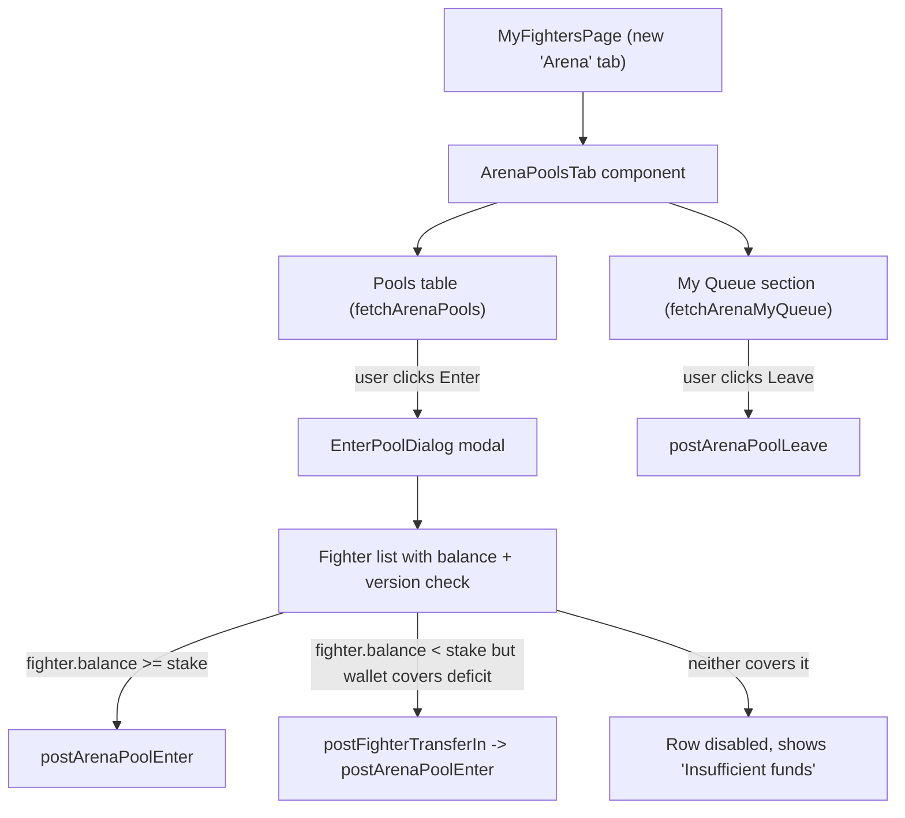
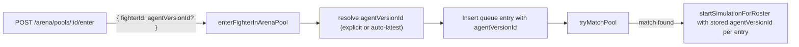

# Arena Pools Frontend Tab

## Context

The arena backend is fully implemented: pool listing, enter/leave, matchmaker, balance locking. The frontend already has API client functions in [`jet-arena/src/lib/api/arena.ts`](jet-arena/src/lib/api/arena.ts) and route constants in [`jet-arena/src/hooks/useRoutes.ts`](jet-arena/src/hooks/useRoutes.ts). What's missing is the UI to browse pools, select a fighter, and enter -- plus locking the agent version at enqueue time so the code that fights is deterministic.

## Architecture





---

## 1. Agent Version Lock (Backend)

Currently the matchmaker passes `agentVersionId: null` into the simulation roster, meaning the fighter's code is resolved at match time (could differ from what the user had at queue time). Fix: lock the version at enqueue time.

### Schema change

Add column to [`database/src/schema/arena-queue-entries.ts`](database/src/schema/arena-queue-entries.ts):

```typescript
agentVersionId: uuid("agent_version_id").references(() => fighterAgentVersions.id, { onDelete: "set null" }),
```

Run `bun run db:generate` to produce the migration.

### Shared schema change

In [`shared/src/schemas/api/arena.ts`](shared/src/schemas/api/arena.ts):
- Add `agentVersionId: z.string().uuid().nullable()` to `arenaQueueEntrySchema`
- Add `agentVersionId: z.string().uuid().optional()` to `arenaEnterPoolRequestSchema`

### Backend logic in [`api/src/lib/arena/matchmaker.ts`](api/src/lib/arena/matchmaker.ts)

**`enterFighterInArenaPool`** changes:
- Accept optional `agentVersionId` param
- If provided: validate it belongs to the fighter+user via `getFighterAgentVersionByIdForOwnerAndFighter` (already exists in simulation-orchestrator deps)
- If not provided: resolve the latest version using `getLatestFighterAgentVersion({ fighterId })` -- reuse existing query
- Store the resolved ID in the queue entry (`enqueueFighter` gets a new `agentVersionId` field)

**`tryMatchPool`** changes:
- When building the roster, read `entry.agentVersionId` from each queue entry and pass it into the roster array instead of `null`

### Frontend API change

In [`jet-arena/src/lib/api/arena.ts`](jet-arena/src/lib/api/arena.ts), update `postArenaPoolEnter` to accept an optional `agentVersionId`:

```typescript
export const postArenaPoolEnter = async (
  poolId: string,
  fighterId: number,
  agentVersionId?: string,
) => post<...>(apiRoutes.arenaPoolEnter(poolId), { fighterId, ...(agentVersionId && { agentVersionId }) });
```

---

## 2. Key Design Decisions (Frontend)

- **New tab value**: `"arena"` added to `MyTab` union in [`jet-arena/src/pages/terminal/MyFightersPage.tsx`](jet-arena/src/pages/terminal/MyFightersPage.tsx)
- **Auto top-up**: handled client-side as two sequential calls (`postFighterTransferIn` for the deficit, then `postArenaPoolEnter`). The existing transfer + enter endpoints compose cleanly.
- **Balance display per fighter in the dialog**: `fetchFighterLedgerSnapshot` per fighter (already in [`jet-arena/src/lib/api/fighter-ledger.ts`](jet-arena/src/lib/api/fighter-ledger.ts)) for `fighterBalanceNative`. Batch on dialog open.
- **Wallet balance**: from `useWalletContext().wallet.balanceNative` -- globally available.
- **Agent version selection**: The dialog shows each fighter's latest agent version number. By default uses latest; if the fighter has multiple versions, a dropdown allows explicit selection. The selected version ID is sent in the enter request.

---

## 3. New Files

- **`jet-arena/src/pages/terminal/components/ArenaPoolsTab.tsx`** -- tab content: pools table + my queue list
- **`jet-arena/src/pages/terminal/components/EnterPoolSheet.tsx`** -- right-side Sheet: fighter picker with balance logic, version picker, top-up + enter flow

## 4. Modified Files

- **[`jet-arena/src/pages/terminal/MyFightersPage.tsx`](jet-arena/src/pages/terminal/MyFightersPage.tsx)** -- expand `MyTab` union, add tab trigger + content
- **[`database/src/schema/arena-queue-entries.ts`](database/src/schema/arena-queue-entries.ts)** -- add `agentVersionId` column
- **[`shared/src/schemas/api/arena.ts`](shared/src/schemas/api/arena.ts)** -- add field to entry and request schemas
- **[`api/src/lib/arena/matchmaker.ts`](api/src/lib/arena/matchmaker.ts)** -- resolve + persist version at enter, use stored version at match
- **[`api/src/lib/arena/pool-repository.ts`](api/src/lib/arena/pool-repository.ts)** -- `enqueueFighter` accepts `agentVersionId`
- **[`jet-arena/src/lib/api/arena.ts`](jet-arena/src/lib/api/arena.ts)** -- `postArenaPoolEnter` accepts optional `agentVersionId`
- **[`shared/src/schemas/api/fighters.ts`](shared/src/schemas/api/fighters.ts)** -- add `pfpUrl: z.string().url().nullable()` to `myFighterSchema`
- **[`api/src/routes/fighters.ts`](api/src/routes/fighters.ts)** (or wherever my-fighters are listed) -- resolve PFP signed URL from `characterPfpObjectKey` when serializing the response

---

## 5. UI Layout for ArenaPoolsTab

**Pools Table** (top section) -- uses shadcn `<Table>` from `jet-arena/src/components/ui/table.tsx` (to be installed via `npx shadcn@latest add table`):
- Columns: Battle Mode | Stake | Queue | Fighters | Action
- Stake column formatted via `formatTokenAmountFromNative(pool.stakeAmountNative, currency.nativeDecimals)` + `currency.symbol` where `currency = getWalletCurrencyMetadata("sui")` (from `@ijf/shared`)
- "Enter" button per row (disabled if user has no fighters with `status: "complete"`)

**My Queue** (below table):
- List of fighters currently queued, with pool info (mode, stake, version number) and a "Leave" button
- Fetched via `fetchArenaMyQueue()`

## 6. EnterPoolSheet Flow

Uses the existing shadcn `<Sheet>` component (`jet-arena/src/components/ui/sheet.tsx`) sliding in from the right (`side="right"`). Rename file to **`EnterPoolSheet.tsx`**.

1. Sheet opens with selected pool info at the top (mode, stake amount)
2. Fetch fighter balances: for each fighter, call `fetchFighterLedgerSnapshot({ fighterId })` for `fighterBalanceNative`
3. Fetch agent versions per fighter: use existing `fetchFighterAgentVersions(fighterId)` endpoint (already in [`jet-arena/src/hooks/useRoutes.ts`](jet-arena/src/hooks/useRoutes.ts) as `apiRoutes.fighterAgentVersions`)
4. Display fighters as selectable rows inside the sheet body (only fighters with `fighter.status === "complete"` are shown -- pipeline must be fully finished across all sections):
   - Fighter name + PFP image (use `fighter.specsheetImageUrl` as fallback; to show actual PFP, add `pfpUrl: z.string().url().nullable()` to `myFighterSchema` and resolve it server-side from the `character-pfp` R2 key, same as `public-fighters.ts` does via `characterPfpObjectKey`)
   - Fighter balance (formatted SUI) with sufficiency indicator (green/yellow/red)
   - Agent version label (e.g. "v3 (latest)") with dropdown if multiple versions exist
   - If `fighterBalance >= stakeAmount` -> green, selectable
   - If `fighterBalance < stakeAmount` but `fighterBalance + walletBalance >= stakeAmount` -> yellow, "Top up X SUI from wallet", selectable
   - If combined insufficient -> red, disabled, "Insufficient funds"
   - If `arenaStatus !== "idle"` -> disabled, "Already in arena"
   - Fighters with `status !== "complete"` are excluded entirely (not shown in the sheet)
5. User selects a fighter (+ optionally picks a version) -> "Enter Pool" button in the sheet footer activates
6. On confirm:
   - If top-up needed: `await postFighterTransferIn({ fighterId, amountNative: deficit })`
   - Then: `await postArenaPoolEnter(poolId, fighterId, selectedAgentVersionId)`
   - On success: close sheet, refresh pools + queue
   - If matched immediately (`match !== null`): show "Matched!" with link to broadcast

## 7. Formatting Helpers

- `formatTokenAmountFromNative` at [`jet-arena/src/lib/formatTokenAmountFromNative.ts`](jet-arena/src/lib/formatTokenAmountFromNative.ts) for MIST -> SUI
- `getWalletCurrencyMetadata("sui")` gives `nativeDecimals: 9`, `symbol: "SUI"`

## 8. Battle Mode Labels

- `"1v1"` -> "1v1"
- `"squad_4"` -> "Squad 4"
- `"squad_8"` -> "Squad 8"
- `"world_war"` -> "World War"
