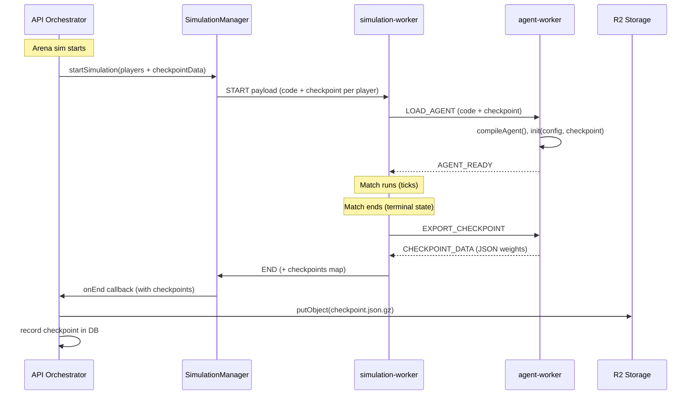

# TF Checkpoint Persistence and Skill Update

## Architecture Overview



## Part 1: AgentModule Contract Extension

Extend `AgentModule` in [`shared/src/simulation/agent.ts`](shared/src/simulation/agent.ts) with two optional methods:

```ts
export interface AgentModule {
  init: (config: RuntimeConfig, checkpoint?: string | null) => void;
  act: (observation: Observation) => AgentAction;
  learn: (observation: Observation, reward: number) => void;
  serialize?: () => string;   // optional: export learned state as JSON string
  deserialize?: (data: string) => void; // optional: restore state (alt to init checkpoint param)
}
```

Key decision: `init(config, checkpoint?)` receives checkpoint data directly. `serialize()` is called at sim end. Both are optional so existing heuristic agents are unaffected.

## Part 2: Worker Protocol Changes

### agent-worker ([`simulator/src/agent-worker.ts`](simulator/src/agent-worker.ts) only — jet-arena client sim is deprecated)

1. Extend `LOAD_AGENT` payload to include optional `checkpoint: string | null`.
2. Pass checkpoint into `agent.init(CONFIG, checkpoint)`.
3. Add new message type `EXPORT_CHECKPOINT` request and `CHECKPOINT_DATA` response:
   - On receiving `EXPORT_CHECKPOINT`, call `agent.serialize?.()` and post result back.
   - If `serialize` is not a function, respond with `null`.

### simulation-worker ([`simulator/src/simulation-worker.ts`](simulator/src/simulation-worker.ts))

1. Extend `SimulationPlayerConfig` in [`simulator/src/simulation.types.ts`](simulator/src/simulation.types.ts) to add `checkpoint?: string | null`.
2. In `createWorkerForPlayer`, pass checkpoint via `LOAD_AGENT` payload.
3. Before calling `stop()` in the terminal-state block, send `EXPORT_CHECKPOINT` to each alive or recently-alive worker, collect responses with timeout.
4. Include `checkpoints: Record<string, string | null>` (playerId -> serialized data) in the `END` message payload.

### Message type updates in [`simulator/src/simulation.types.ts`](simulator/src/simulation.types.ts)

```ts
type AgentWorkerRequestMessage =
  | { type: "LOAD_AGENT"; payload: { code: string; checkpoint?: string | null } }
  | { type: "TICK"; payload: { requestId: number; observation: Observation; reward: number } }
  | { type: "EXPORT_CHECKPOINT" };

type AgentWorkerResponseMessage =
  | { type: "AGENT_READY" }
  | { type: "AGENT_ERROR"; payload: { error: string } }
  | WorkerActionResponseMessage
  | { type: "CHECKPOINT_DATA"; payload: { data: string | null } };
```

The `END` SimulationWorkerResponseMessage gains:

```ts
data: {
  winnerId: string | null;
  winnerFighterId: number | null;
  replayHashHex: string;
  frames: ReplayFrame[];
  checkpoints: Record<string, string | null>; // NEW
};
```

## Part 3: Checkpoint Storage

### New R2 key helper in [`api/src/lib/r2.ts`](api/src/lib/r2.ts)

```ts
export const fighterCheckpointObjectKey = (userId: string, fighterId: number, simulationId: string) =>
  path.posix.join(`users/${userId}/fighters/${String(fighterId)}`, "checkpoints", `${simulationId}.json.gz`);

export const fighterLatestCheckpointObjectKey = (userId: string, fighterId: number) =>
  path.posix.join(`users/${userId}/fighters/${String(fighterId)}`, "checkpoints", "latest.json.gz");
```

### New DB table: `fighter_checkpoints`

In [`database/src/schema/`](database/src/schema/):

```ts
export const fighterCheckpoints = pgTable("fighter_checkpoints", {
  id: uuid("id").defaultRandom().primaryKey(),
  fighterId: integer("fighter_id").notNull().references(() => fighters.id, { onDelete: "cascade" }),
  userId: uuid("user_id").notNull().references(() => neonAuthUser.id, { onDelete: "cascade" }),
  simulationId: uuid("simulation_id").notNull().references(() => simulations.id, { onDelete: "cascade" }),
  agentVersionId: uuid("agent_version_id").references(() => fighterAgentVersions.id, { onDelete: "set null" }),
  objectKey: text("object_key").notNull(),
  sizeBytes: integer("size_bytes").notNull(),
  createdAt: timestamp("created_at", { withTimezone: true, mode: "date" }).defaultNow().notNull(),
});
```

Run `bun run db:generate` after adding.

## Part 4: API Orchestrator Changes

In [`api/src/lib/simulation-orchestrator.ts`](api/src/lib/simulation-orchestrator.ts):

### Loading checkpoint at start (arena sims only)

In `resolvePlayerFromSources`, after resolving agent code, fetch the latest checkpoint for that (fighterId + agentVersionId) from R2. Pass it into the player config so `startSimulation` sends it to the sim worker.

### Saving checkpoint at end

In `finalizeEndedSimulation`, after writing replay artifacts:

1. The `END` message now includes `checkpoints` map.
2. For each participant with non-null checkpoint data, gzip and `putObject` to R2.
3. Insert row into `fighter_checkpoints`.
4. Overwrite `fighterLatestCheckpointObjectKey` for quick access.

Only perform this for arena pool sims (check `arenaPoolId` is non-null).

## Part 5: Download Endpoint

New route in [`api/src/routes/fighters/index.ts`](api/src/routes/fighters/index.ts) or new file:

```
GET /fighters/:id/checkpoint
```

Returns a signed R2 URL to the latest checkpoint for that fighter (owner-gated). Optionally accept `?simulationId=` to get a specific one.

Also expose in the agent-versions list response so the frontend can show "has checkpoint" badges.

## Part 6: Skill Update — Allow TensorFlow

Update [`api/src/skills/character-description-to-jet-agent.md`](api/src/skills/character-description-to-jet-agent.md):

### Changes to the skill document

1. **Remove the TF ban** — line 177: change `- \`tf\` / TensorFlow.js — no external libraries of any kind` to document `tf` as an **available** injected global (like `CONFIG`).

2. **Add `tf` to the Available section** (line 162-167):
   ```
   - `tf` — TensorFlow.js library (injected; available only when code references `tf.`)
   ```

3. **Add checkpoint methods to the Hard Requirements section** — document `serialize()` and checkpoint-aware `init(config, checkpoint)`.

4. **Add a TF decision heuristic to the Mapping Workflow** — after step 2 ("Map anchors to mechanics"), insert guidance:
   - Characters with **adaptive**, **learning**, **patient**, **evolving** temperament or where the lore emphasizes growth/memory -> use DQN with replay buffer.
   - Characters that are **instinctive**, **twitchy**, **reactive** -> use lightweight online policy (REINFORCE-lite or simple weight adjustment).
   - Characters that are purely **dogmatic**, **ritualistic**, **mechanical** -> heuristic only (no TF).

5. **Add a TF DQN skeleton** (alongside existing heuristic skeleton):

```ts
globalThis.__agentExport = (() => {
  let model;
  let optimizer;
  const replayBuffer = [];
  const MAX_REPLAY = 400;
  const BATCH_SIZE = 16;
  const GAMMA = 0.95;
  let epsilon = 0.3;
  let previousState = null;
  let previousAction = 0;

  const ACTIONS = [
    { thrust: 1, turn: 0, climb: 0, shoot: false },
    // ... define action space
  ];

  const vectorize = (obs) => { /* ... */ };

  const createModel = () => {
    model = tf.sequential({ layers: [
      tf.layers.dense({ inputShape: [/* obs size */], units: 32, activation: "relu" }),
      tf.layers.dense({ units: 32, activation: "relu" }),
      tf.layers.dense({ units: ACTIONS.length, activation: "linear" }),
    ]});
    optimizer = tf.train.adam(0.001);
  };

  return {
    init(config, checkpoint) {
      createModel();
      if (checkpoint) {
        const parsed = JSON.parse(checkpoint);
        model.setWeights(parsed.weights.map(w => tf.tensor(w.data, w.shape)));
        epsilon = parsed.epsilon ?? 0.1;
      }
    },
    serialize() {
      const weights = model.getWeights().map(w => ({
        data: Array.from(w.dataSync()),
        shape: w.shape,
      }));
      return JSON.stringify({ weights, epsilon });
    },
    learn(observation, reward) { /* replay buffer + train */ },
    act(observation) { /* epsilon-greedy inference */ },
  };
})();
```

6. **Add a lightweight learner skeleton** for the "instinctive" path:

```ts
globalThis.__agentExport = (() => {
  let weights = null; // simple linear policy weights

  return {
    init(config, checkpoint) {
      weights = checkpoint ? JSON.parse(checkpoint) : randomInit();
    },
    serialize() { return JSON.stringify(weights); },
    learn(observation, reward) { /* simple gradient step on weights */ },
    act(observation) { /* linear policy: dot(weights, features) -> action */ },
  };
})();
```

7. **Update Quick Validation Checklist** — add:
   - `serialize()` returns valid JSON string (or is omitted for heuristic agents)
   - TF calls wrapped in `tf.tidy()` to prevent memory leaks
   - `init` handles `checkpoint = null` gracefully (fresh start)

## Part 7: Size Limits and Safety

- Cap serialized checkpoint size at **2 MB** (gzipped). If `serialize()` returns more, discard and log a warning.
- Timeout for `EXPORT_CHECKPOINT` response: **3 seconds** (same spirit as `ACTION_TIMEOUT_MS`).
- Never block the END lifecycle on checkpoint failure — fire-and-forget with error logging.

## Verification of determinism

Replays remain fully deterministic. The replay function simply gains one more input:

```
replay = f(code, seed, checkpoint)
```

Same code + same seed + same checkpoint = identical replay every time. Nothing becomes non-reproducible.

The only shift is what a verifier needs to re-derive the match: previously `code + seed` was sufficient, now `code + seed + checkpoint` is required. The system stores the checkpoint alongside the other inputs, so the full verification set is always available.

To support this, record `checkpointHash` alongside `agentHash` in `simulation_participants` so any verifier or on-chain dispute resolver can demand all three inputs and confirm the `replayHashHex` matches.

Add `checkpointHash: text("checkpoint_hash")` column to `simulation_participants` schema.
